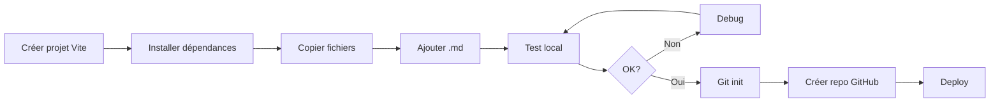

# 📚 INDEX - Documentation Complète QCM

Tous les fichiers nécessaires pour créer l'application QCM avec Claude Code.

---

## 📁 Structure de la Documentation

### Fichiers de Configuration

1. **00-BRIEF-CLAUDE-CODE.md** - Vue d'ensemble du projet
2. **01-package.json** - Dépendances npm
3. **02-vite.config.js** - Configuration Vite
4. **03-tailwind.config.js** - Configuration Tailwind CSS

### Utilitaires (src/utils/)

5. **04-utils-markdownParser.js** - Parser pour fichiers .md
6. **05-utils-quizManager.js** - Gestion des quiz (chargement, sélection)

### Composants React (src/components/)

7. **06-components-QuizHeader.jsx** - En-tête avec progression
8. **07-components-QuizQuestion.jsx** - Affichage question + options
9. **08-components-QuizResults.jsx** - Écran de résultats

### Application Principale

10. **09-App.jsx** - Composant principal de l'application

### Fichiers Supplémentaires

11. **10-autres-fichiers.md** - index.html, main.jsx, index.css, etc.

### Déploiement

12. **11-deploiement-github.md** - Guide complet GitHub Pages

---

## 🚀 Utilisation avec Claude Code

### Méthode 1 : Copier-Coller Direct

1. Ouvrir Claude Code
2. Copier le contenu du fichier **00-BRIEF-CLAUDE-CODE.md**
3. Demander à Claude Code :

```
Crée une application React QCM selon ce brief.
Voici les spécifications complètes :

[Coller le brief]

Utilise les fichiers fournis dans la documentation :
- 01-package.json pour les dépendances
- 02-vite.config.js pour la config
- etc.
```

### Méthode 2 : Créer Manuellement

1. Créer le projet avec Vite :
```bash
npm create vite@latest qcm-gardien-paix -- --template react
cd qcm-gardien-paix
```

2. Installer les dépendances (voir 01-package.json)

3. Copier chaque fichier à sa place selon la structure

4. Ajouter vos fichiers .md dans `/public/qcm/`

---

## 📋 Checklist de Création

### Phase 1 : Setup Initial
- [ ] Créer projet Vite
- [ ] Installer dépendances (npm install)
- [ ] Installer Tailwind (npm install -D tailwindcss...)
- [ ] Installer gh-pages
- [ ] Initialiser Tailwind (npx tailwindcss init -p)

### Phase 2 : Structure de Dossiers
- [ ] Créer `/src/components/`
- [ ] Créer `/src/utils/`
- [ ] Créer `/public/qcm/`

### Phase 3 : Copier les Fichiers
- [ ] package.json (fichier 01)
- [ ] vite.config.js (fichier 02) - ⚠️ Modifier le `base`
- [ ] tailwind.config.js (fichier 03)
- [ ] postcss.config.js (fichier 10)
- [ ] src/utils/markdownParser.js (fichier 04)
- [ ] src/utils/quizManager.js (fichier 05)
- [ ] src/components/QuizHeader.jsx (fichier 06)
- [ ] src/components/QuizQuestion.jsx (fichier 07)
- [ ] src/components/QuizResults.jsx (fichier 08)
- [ ] src/App.jsx (fichier 09)
- [ ] src/main.jsx (fichier 10)
- [ ] src/index.css (fichier 10)
- [ ] index.html (fichier 10)
- [ ] .gitignore (fichier 10)
- [ ] README.md (fichier 10)

### Phase 4 : Ajouter les QCM
- [ ] Copier vos fichiers .md dans `/public/qcm/`
- [ ] Mettre à jour la liste dans `quizManager.js`

### Phase 5 : Test Local
- [ ] Lancer `npm run dev`
- [ ] Vérifier que l'application fonctionne
- [ ] Tester le chargement des questions
- [ ] Vérifier les scores

### Phase 6 : Déploiement
- [ ] Créer repo GitHub
- [ ] Configurer Git local
- [ ] Modifier `base` dans vite.config.js
- [ ] Premier commit
- [ ] Déployer avec `npm run deploy`

---

## 🎯 Commande Rapide pour Claude Code

```
Je veux créer une application React de QCM selon cette documentation.

ARCHITECTURE :
- React 18 + Vite
- TailwindCSS
- Fichiers .md dans /public/qcm/
- Sélection aléatoire des quiz
- Déploiement GitHub Pages

STRUCTURE :
[Montrer la structure de projet du brief]

FONCTIONNALITÉS :
1. Chargement aléatoire d'un fichier QCM
2. Affichage question par question
3. Feedback immédiat (vert/rouge)
4. Sources cliquables
5. Scoring en temps réel
6. Écran de résultats

Crée tous les fichiers nécessaires selon la documentation fournie.
```

---

## 📞 Support

En cas de problème :

1. Vérifier la **checklist** ci-dessus
2. Consulter le **11-deploiement-github.md** pour le troubleshooting
3. Vérifier que les chemins des fichiers correspondent

---

## 🔄 Workflow de Développement



---

**Location de ces fichiers** :  
`/Users/didier/Library/CloudStorage/OneDrive-KEDGEBusinessSchool/Capstone Project/Assignment/Build/qcm-project-docs/`

**Prochaines étapes** :
1. Déplacer ce dossier où vous voulez
2. Ouvrir Claude Code
3. Suivre le guide !

---

**Bonne chance ! 🚀**
